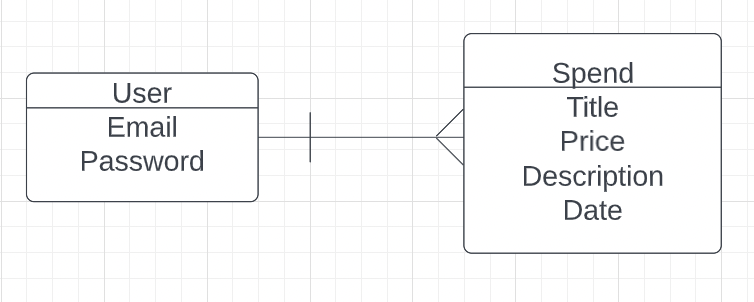

# Expense Tracker API 

This page is the backend of the expense tracker app. The front-end code can be found at https://github.com/steph-kimm/expense_recorder.

# Entity-relationship model 

The entity-relationship model can be viewed below. 
 

### _User Authorization Routes_

| HTTP Method   | URL Path        | Result               | Action           |
|:--------------|:----------------|:---------------------|:-----------------|
| POST          | /sign-up        | create profile       | create           |
| POST          | /sign-in        | get single profile   | show or retrieve |
| DELETE        | /sign-out       | delete profile       | destroy          |
| PATCH         | /change-password| update password      | update           |

### _Profile Routes_

| HTTP Method   | URL Path        | Result               | Action           |
|:--------------|:----------------|:---------------------|:-----------------|
| GET           | /profiles       | read list of profiles| index or list    |
| GET           | /profiles/`:id` | read single profile  | show or retrieve |
| POST          | /profile        | create profile       | create           |
| PATCH         | /profiles/`:id` | update profile       | update           |
| DELETE        | /profiles/`:id` | delete profile       | destroy          |

### _Expenses Route_

| HTTP Method   | URL Path        | Result               | Action           |
|:--------------|:----------------|:---------------------|:-----------------|
| GET           | /expenses           | see list of films   | index or list    |

## Technologies Used

|    Libraries      | Languages        | Frameworks              | Database          | Version Control      | API           |
|:-----------------------------------------|:----------------|:---------------------|:-----------------|:--------------------|:-----------------|
| [React.js](https://reactjs.org/)       |    [HTML](https://developer.mozilla.org/en-US/docs/Web/HTML)        |  [Express](https://expressjs.com/) | [MongoDB](https://www.mongodb.com/)   | [GitHub](https://github.com/) | [Ghibli Studio API](https://ghibliapi.herokuapp.com/)     |
|   [Axios](https://www.npmjs.com/package/axios)        | [Javascript](https://www.javascript.com/)          | [BootStrap](https://getbootstrap.com/)       |           |
|   [Mongoose](https://mongoosejs.com/)         | [CSS](https://developer.mozilla.org/en-US/docs/Web/CSS)          |        |          |
|         |           |        |         |

contact: stephspie3.1415@gmail.com